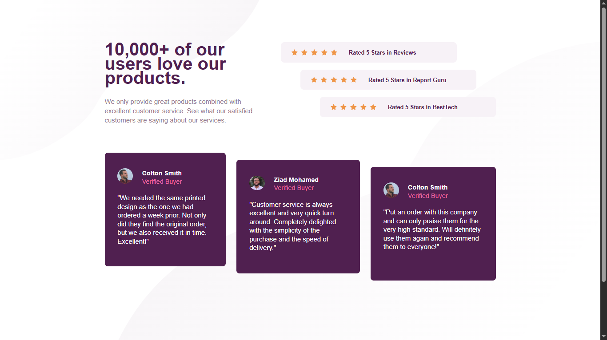

# ⭐ Social Proof Section

  

A responsive social proof section built with HTML and CSS as part of a Frontend Mentor challenge, featuring responsive backgrounds, CSS Grid layouts, and carefully structured content.

## 📖 About the Challenge

This project is a solution to a Frontend Mentor challenge focused on recreating a social proof section with customer testimonials, rating cards, responsive backgrounds, and an adaptive layout across different screen sizes.

## ✨ Highlights

- 📱 Responsive layout for mobile, tablet, and desktop screens.
- 🖼️ Multiple responsive background images for different screen sizes.
- ⭐ Rating cards with star icons and responsive positioning.
- 💬 Customer testimonial cards with staggered desktop positioning.
- 🧱 CSS Grid used to create complex desktop layouts.
- 🔤 Custom typography using Google Fonts.
- 📐 Responsive design with multiple breakpoints.
- 🧩 Explored modern CSS text layout properties.

## 🛠️ Built With

  

## 💡 Key Takeaways

Throughout this project, I:

- Improved my CSS Grid skills by creating complex layouts for both the rating section and customer testimonials.
- Learned how to use multiple background images and position them independently.
- Used `dvh` to create a flexible viewport-based layout and keep the footer positioned at the bottom of the page.
- Explored `text-box-trim` and `text-box-edge` to improve text alignment and wrapping in responsive layouts.
- Practiced choosing appropriate grid columns, rows, and breakpoints for different screen sizes.
- Improved my problem-solving skills by experimenting with different layout approaches until reaching a responsive solution.
- Gained more confidence working with complex responsive layouts rather than simple components.

## 🔗 Links

- 🌐 **Live Site:** https://frontend-mentor-social-proof-sectio-kappa.vercel.app/
- 💻 **Repository:** https://github.com/Ziad-mo205/Frontend-Mentor---Social-Proof-Section.git
- 🎯 **Frontend Mentor Solution:**
